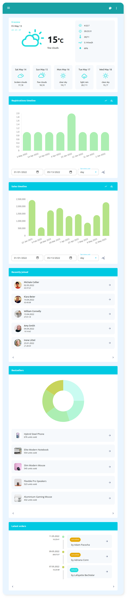

A slim admin dashboard template created with Next.js and Material UI, with a built-in file manager.

 

    
    
    
    
    
    

 
<h4 align="center">Live version</h4>
<h4 align="center" style="text-align: center;"></h4> 

<h4 align="center">Created in</h4>
 

    
    
    

